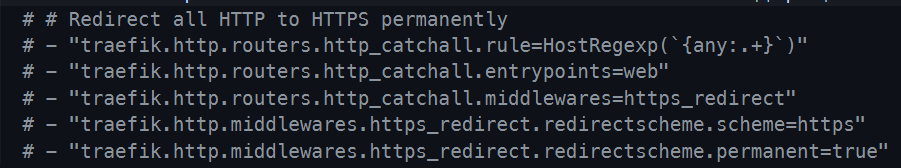

# Documentação para Configuração com Ansible


## Estrutura do Projeto
```markdown
.
├── ansible.cfg
├── inventory
│   └── hosts.ini
├── playbooks
│   └── deploy-full-zabbix.yml
└── roles
    ├── postgresql
    │   ├── defaults
    │   │   └── main.yml
    │   ├── handlers
    │   │   └── main.yml
    │   └── tasks
    │       └── main.yml
    ├── zabbix_db
    │   ├── defaults
    │   │   └── main.yml
    │   └── tasks
    │       └── main.yml
    └── zbx-docker
        ├── defaults
        │   └── main.yml
        ├── files
        │   ├── docker-compose.prod.yaml
        │   ├── docker-compose.traefik.yaml
        │   └── envs
        │       ├── dbzbx_prod.env
        │       ├── zabbix-frontend
        │       │   └── common.env
        │       ├── zabbix-java
        │       │   └── commom.env
        │       ├── zabbix-proxy
        │       │   └── common.env
        │       └── zabbix-server
        │           └── common.env
        ├── handlers
        │   └── main.yml
        ├── tasks
        │   └── main.yml
        └── vars
            └── main.yml
```


## DEPLOY

## Pré-requisitos

### Edite o Arquivo "ansible-deploy-full-zabbix/roles/zbx-docker/vars/main.yml"

##### VARIAVEIS ZABBIX E GRAFANA

```bash
zabbix_image_version: "7.0.6-alpine" - Versao da imagem do Zabbix
grafana_image_version: "11.4.0" - Versao da Image do Grafana
zabbix_domain: "exemplo.com.br" - Dominio que era ser anexado na url EX: zabbix.exemplo.com.br.
zabbix_stack_name: "zbx-swarm" nome da stack . (Caso queira mudar o nome, deve alterar no arquivos de ENVS ansible-deploy-full-zabbix/roles/zbx-docker/files/envs)
ip_data_base: "10.158.0.4" - IP da database Caso esteja utilizando td na mesma maquina virtual, especificar mesmo assim o IP.

##### EDITAR O INVENTORY E O MESMO IP QUE ESTIVER DECLARO NO Vagrantfile

```bash
ansible-deploy-full-zabbix/inventory/hosts.ini
```

### RODAR O SCRIPT

Entre de na pasta ansible-deploy-full-zabbix

```bash
cd ansible-deploy-full-zabbix
```
De as permissoes de execuçao para o script

```bash
chmod +x deploy.sh
```

Execute o script

```bash
./deploy.sh
```

#### Apos finalizar so mapear nos hosts da sua maquina, ou cadrastrar o ip no seu servidor de DNS.

#### URL DE ACESSO
OBS: Temos 3 URL de acesso.

```bash
zabbix.$zabbix_domain
traefik.$zabbix_domain
grafana.$zabbix_domain
```

#### Zabbix
Usuario: Admin
Senha: zabbix

#### Grafana
Usuario: admin
Senha: admin

### Caso queria ativar o Redirect para HTTPS automatico, so descomentar essas linhas no `docker-compose.traefik.yaml`

